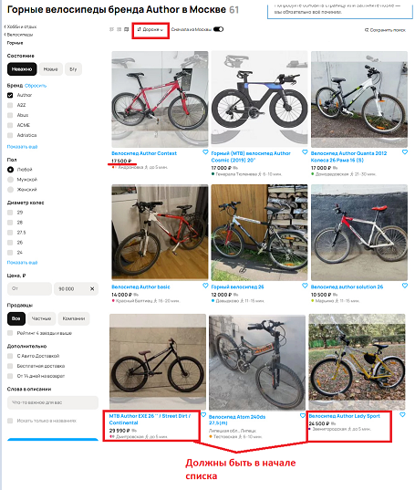
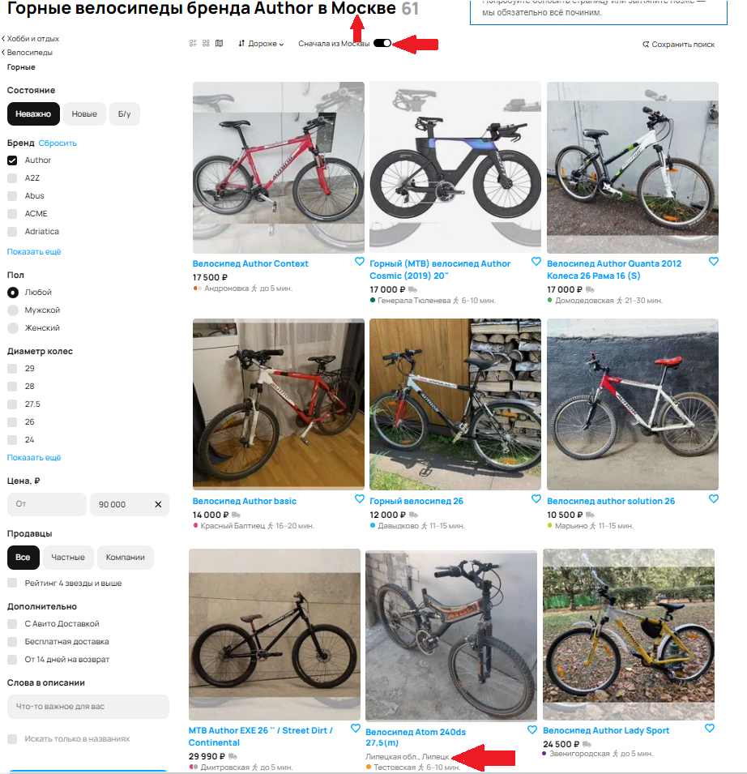

## Баги на странице со скриншота

**1. [Кнопка "Все категории"]** Грамматическая ошибка: "Все категори" вместо "Все категории".
Приоритет: low

**2. [Хлебные крошки]** Отсутствуют две конечные хлебные крошки "горные" и "Author".
Приоритет: low

**3. [Текстовое поле]** Система сообщает об ошибке, хотя в реальности функциональность сайта не нарушена. 
Приоритет: medium (Пользователь может покинуть сайт, увидев сообщение об ошибке, думая, что ведутся тех. работы, хотя на самом деле проблем нет)

**4 [Иконка способа отображения объявлений]** Указана неверная иконка способа отображения объявлений (Указана кнопка объявлений на карте, а объявления отображаются в виде галереи).  
Приоритет: low  

**5. [Результаты поиска]** Не совпадает найденное количество объявлений в кнопке “Показать N объявлений” и в заголовке страницы.
Приоритет: low 

**6. [Изображение в объявлении]** Изображение в объявлении не совпадает с товаром, указанном в заголовке объявления.
Приоритет: low  
>Вероятно, это может быть ошибкой при модерации объявления, но не стоит исключать вероятность некорректного отображения изображения или заголовка

**7. [Поиск по фильтру "Бренд"]** Некорректно отрабатывает фильтр. Присутствуют объявления, не удовлетворяющие заданному фильтру. (При выбранном фильтре "бренд" со значением "Author" присутствует объявление о продаже велосипеда "Atom").
Приоритет: high, т.к. некорректно работает одна из основных функциональностей - работа фильтров

**8. [Сортировка объявлений]** Некорректная работа сортировки по убыванию цены. При выборе параметра "дороже" (от дорогих к дешевым) объявления отображаются в неправильном порядке: сначала дешевые, затем дорогие.
Приоритет: high, т.к. некорректно работает одна из основных функциональностей - сортировка по цене

**9. [Фильтрация по городу]** Некорректно работает поиск по городу. В тексте запроса указано, что рассматривают объявления по Москве и стоит чекбокс "Сначала из Москвы", но присутствуют объявления не подходящие к тексту объявления.
Приоритет: high, т.к. нарушена работа фильтра и поиск по городу некорретно работает.

**10. [Заголовки объявления]** Заголовки объявлений имеют разные верхние отступы. Это может влиять на смещение информации о городе объявления, цене и на последующие объявления. 
Приоритет: low

